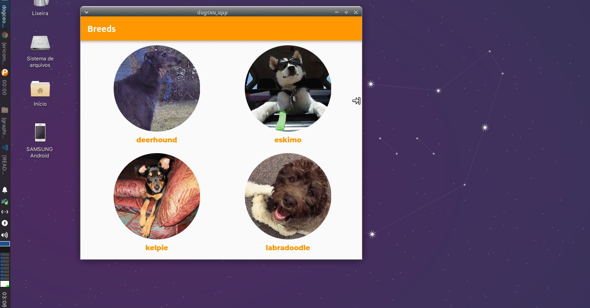
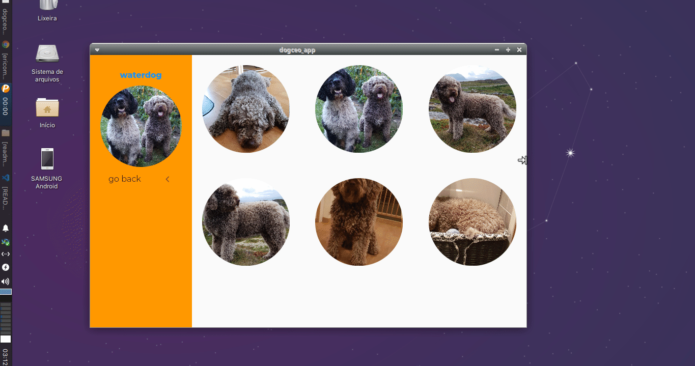
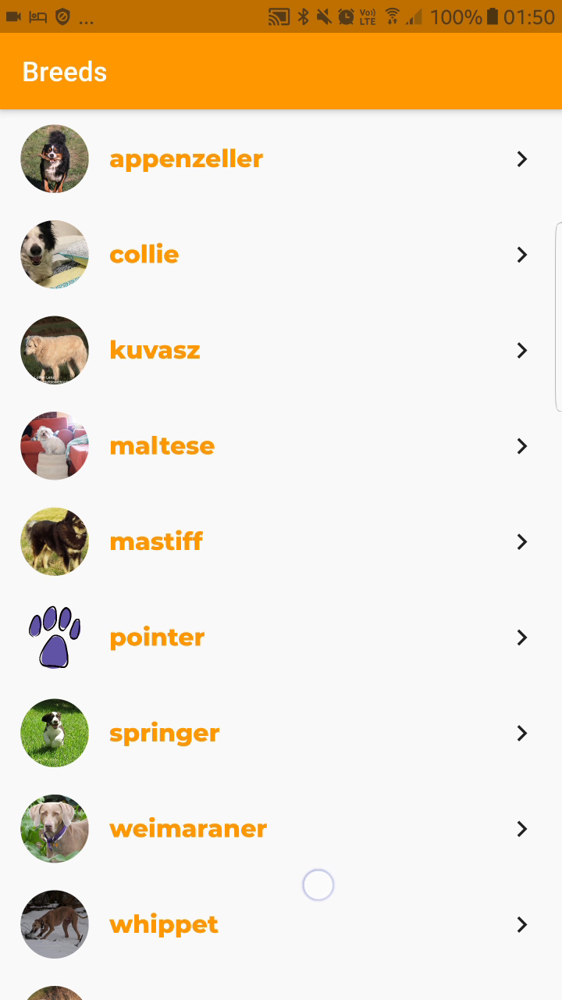
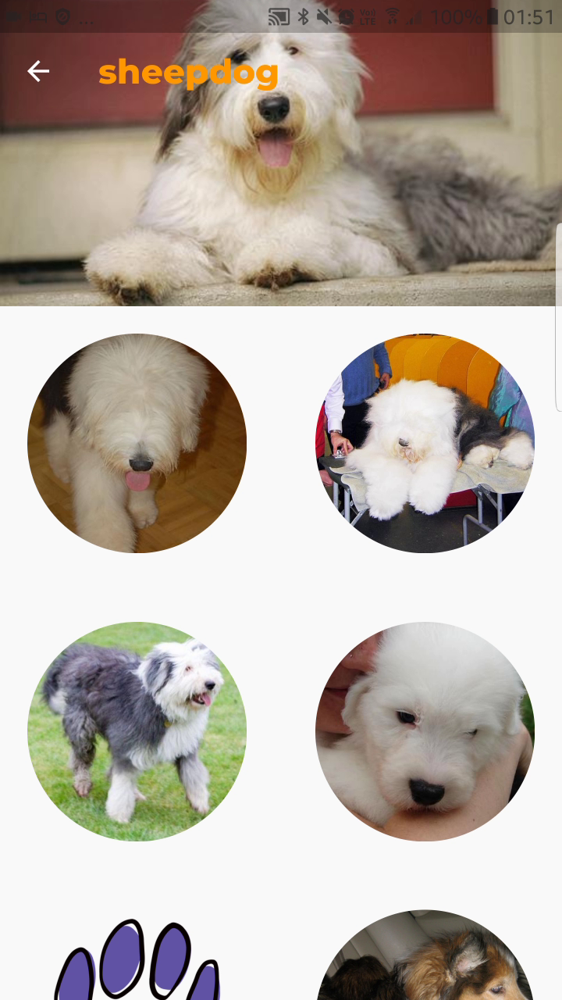
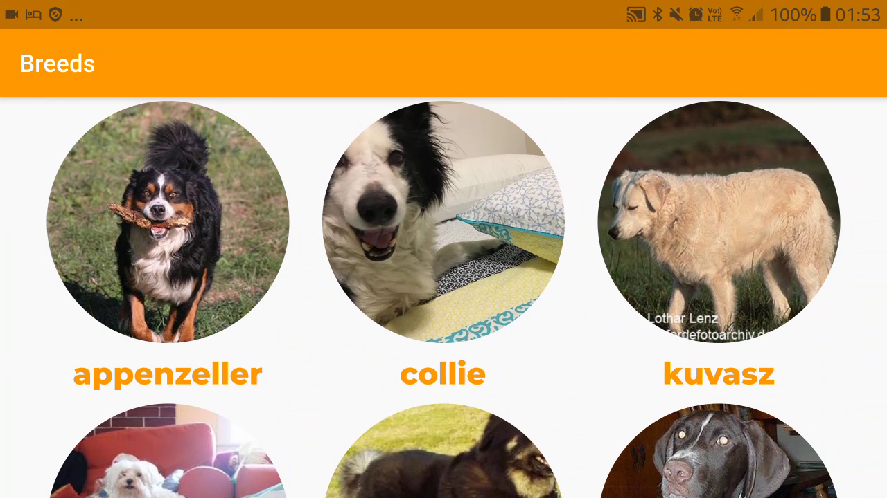
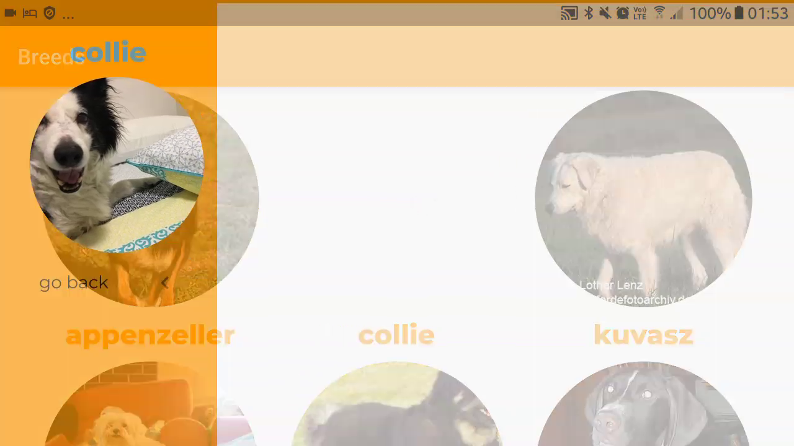
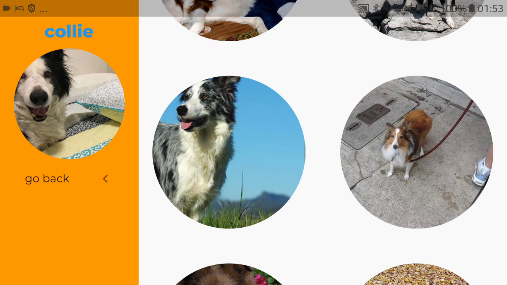
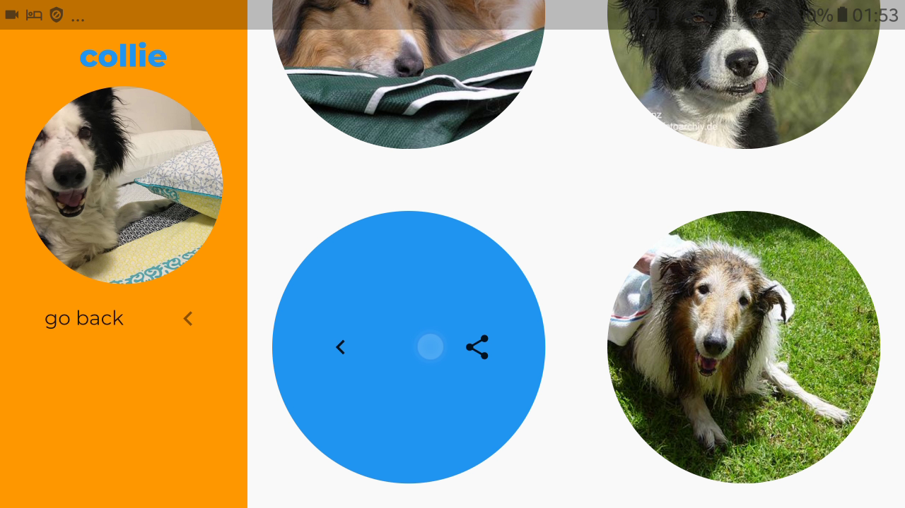

# dogceo_app

Um projeto Flutter consumindo a API [dog.ceo](https://dog.ceo/dog-api/documentation/)

## Screenshots

<div>
    
</div>
<div>
    
</div>

<div>
    
    
    
</div>
<div>
    
    
</div>
<div>
    
    
</div>
<div>
    
    
</div>

## Pré-requisitos

- Este projeto faz uso de sound null-safety, por isso depende do Flutter v2.

## Instruções para execução

1. Garantir que o ambiente está corretamente configurado.
2. Fazer git clone deste projeto.
3. Seguir com os passos convencionais de build para Flutter
```
flutter pub get
flutter run
```

## Sobre a API

### Sobre paginação

Consultando o [github da API](https://github.com/ElliottLandsborough/dog-ceo-api) (no momento, é a melhor
documentação da API disponível), observei que só é possível consultar ou (i) todas as raças de cachorro ou
(ii) um conjunto aleatório de raças e que (iii) não há um endpoint com paginação disponível.

Dessa forma, para simular uma situação mais comum, onde a API seria chamada uma vez a cada nova página,
optei por utilizar o endpoint de raças aleatórias e verificar raças repetidas. Isto afeta gravemente a performance da
aplicação, pois para obter uma nova página pode ser necessário fazer várias chamadas. Porém, faz mais sentido
do que salvar a lista completa na primeira leitura.

## Sobre arquitetura

O projeto está baseado de forma solta na Clean Architecture.

Em alguns trechos resolvi explorar outras ideias, como por exemplo a utilização do padrão 
[domain model](https://martinfowler.com/eaaCatalog/domainModel.html) na classe Breed (para o carregamento de imagens) em vez da abordagem mais tradicional da Clean Architecture, que seria o uso de use cases. Fiz isso de forma demonstrativa, não necessariamente é a melhor forma de fazer (eu prefiro use cases).

## Sobre gerência de estado

Utilizei MobX e em um trecho pequeno utilizei ValueNotifier. Optei por MobX porque para mim é mais rápido
desenvolver com ele, no entanto de forma geral tenho preferido utilizar Provider+StateNotifier para gerência 
de estado (_separation of concerns_ fica um pouco melhor do que com MobX).

## Funcionalidades requeridas

- Exibir lista de raças, paginado de 10 em 10 itens,
- Exibir lista de imagens de uma determinada raça, paginado de 10 em 10 itens,
- Carrega próxima página ao chegar no final da tela.

## Funcionalidades extras

Além do que foi solicitado, implementei essas funcionalidade:

- Compartilhamento das imagens (você pode clicar em uma imagem e compartilhá-la),
- Responsividade,
- Hero animations aplicadas às imagens dos cachorros,
- Testes unitários referentes ao BreedRepository e à API,
- Splash screen e launcher icon.

## Pontos que podem ser melhorados

- Performance pobre nas consultas da API,
- Em vez de escutar o fim das listas para carregar mais itens, poderia utilizar
algum widget que forneça as ações de carregamento com pull-up,
- O tratamento na UI para bloquear o duplo clique ao clicar em compartilhar pode ser melhorado,
- Usar algo como AnimatedOpacity para ocultar as imagens dos cachorros mostradas na SliverAppBar da galeria.

## Outras observações

- É possível olhar a evolução do código através das branches no repositório.
- Utilizei a compilação do Flutter para Linux para acelerar o processo de desenvolvimento.
